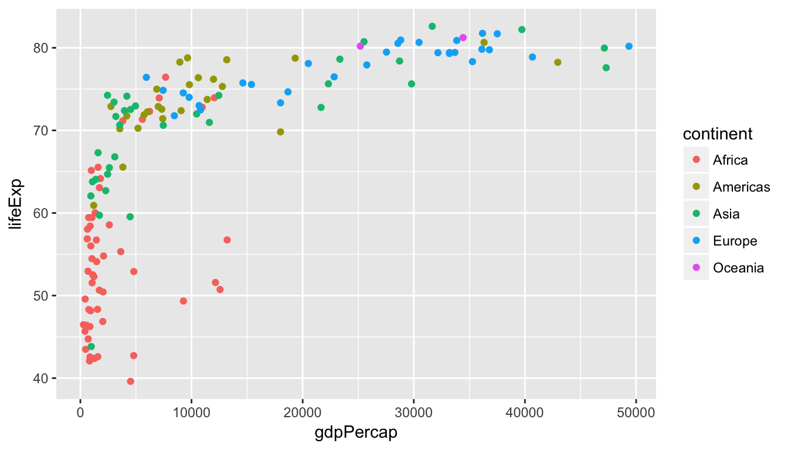
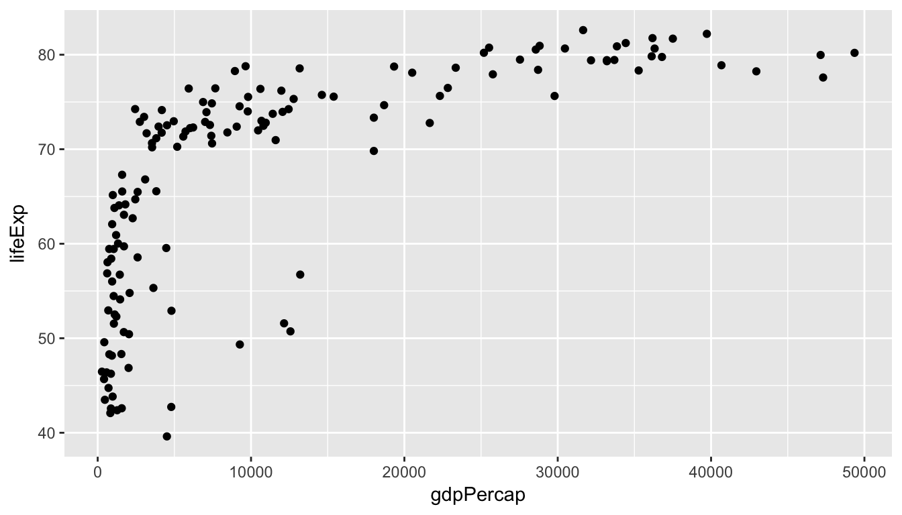

# Mini HW 02 - Visualizing Gapminder data
Mine Cetinkaya-Rundel  
Aug 31, 2017  


Load required packages:


```r
library(readr)
library(ggplot2)
library(dplyr)
```

Load data:


```r
gap <- read_csv("https://stat.duke.edu/~mc301/data/gapminder.csv")
```

Subset the data for just one year, in this case 2007:


```r
gap_subset <- gap %>%
  filter(year == 2007)
```

Visualize the relationship between `gdpPercap` and `lifeExp`, coloring the points by `continent`:


```r
ggplot(data = gap_subset, aes(x = gdpPercap, y = lifeExp, color = continent)) +
  geom_point()
```

<!-- -->


```r
ggplot(data = gap_subset, aes(x = gdpPercap, y = lifeExp)) +
  geom_point()
```

<!-- -->

Describe the relationship you see in the plot:
